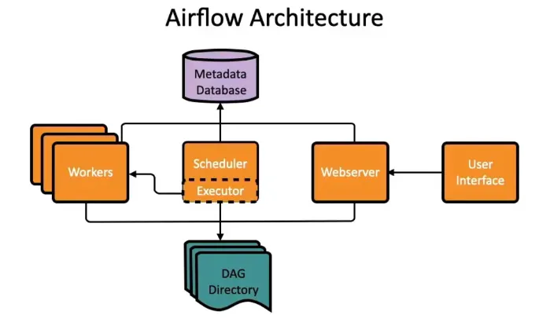

# Apache Airflow

> [!NOTE]   
> **Status**: In Progress

---

## What is Airflow?

A platform to **programmatically author, schedule, and monitor** data workflows as code (Python).

**Use cases:** ETL/ELT pipelines · Glue jobs · EMR clusters · ML pipeline orchestration

---

## Architecture



---

<h2>Core Concepts</h2>

<table border="1" cellpadding="8" cellspacing="0">
  <thead>
    <tr>
      <th>Term</th>
      <th>Definition</th>
    </tr>
  </thead>
  <tbody>
    <tr>
      <td><strong>DAG</strong> (Directed Acyclic Graph)</td>
      <td>A workflow — a collection of Tasks with defined dependencies</td>
    </tr>
    <tr>
      <td><strong>Task</strong></td>
      <td>A single unit of work inside a DAG</td>
    </tr>
    <tr>
      <td><strong>Operator</strong></td>
      <td>
        Defines <em>what</em> a Task does:
        <br>
        <details>
          <summary><strong>Operator types</strong></summary>
          <br>
          <table border="1" cellpadding="6" cellspacing="0">
            <thead>
              <tr>
                <th>Operator</th>
                <th>Purpose</th>
              </tr>
            </thead>
            <tbody>
              <tr>
                <td><code>BashOperator</code></td>
                <td>Execute a bash command</td>
              </tr>
              <tr>
                <td><code>PythonOperator</code></td>
                <td>Call a Python function</td>
              </tr>
              <tr>
                <td><code>BranchPythonOperator</code></td>
                <td>Conditional branching in a DAG</td>
              </tr>
              <tr>
                <td><code>EmptyOperator</code></td>
                <td>No-op, useful for grouping</td>
              </tr>
              <tr>
                <td>Custom Operator</td>
                <td>Extend <code>BaseOperator</code> for reusable logic</td>
              </tr>
            </tbody>
          </table>
        </details>
      </td>
    </tr>
    <tr>
      <td><strong>DAG Run</strong></td>
      <td>A DAG instance triggered at a specific date</td>
    </tr>
    <tr>
      <td><strong>Task Instance</strong></td>
      <td>A Task within a specific DAG Run</td>
    </tr>
    <tr>
      <td><strong>Execution Date</strong></td>
      <td>The logical date of a DAG Run (not necessarily wall-clock time)</td>
    </tr>
    <!-- Scheduling Section -->
    <tr>
      <td><strong>Scheduling</strong></td>
      <td>
        Defines when a DAG runs:
        <br>
        <details>
          <summary><strong>Schedule types</strong></summary>
          <br>
          <table border="1" cellpadding="6" cellspacing="0">
            <thead>
              <tr>
                <th>Schedule</th>
                <th>Meaning</th>
              </tr>
            </thead>
            <tbody>
              <tr>
                <td><code>@once</code></td>
                <td>Run once</td>
              </tr>
              <tr>
                <td><code>@daily</code></td>
                <td>Every day at midnight</td>
              </tr>
              <tr>
                <td><code>@hourly</code></td>
                <td>Every hour</td>
              </tr>
              <tr>
                <td><code>0 6 * * *</code></td>
                <td>Cron — every day at 6 AM</td>
              </tr>
              <tr>
                <td><code>None</code></td>
                <td>Manual trigger only</td>
              </tr>
            </tbody>
          </table>
          <br>
          <em><code>catchup=False</code> — prevents backfilling missed runs on first deploy.</em>
        </details>
      </td>
    </tr>
    <!-- Task States Section -->
    <tr>
      <td><strong>Task States</strong></td>
      <td>
        Lifecycle states of a task:
        <br>
        <details>
          <summary><strong>State definitions</strong></summary>
          <br>
          <table border="1" cellpadding="6" cellspacing="0">
            <thead>
              <tr>
                <th>State</th>
                <th>Description</th>
              </tr>
            </thead>
            <tbody>
              <tr>
                <td><code>scheduled</code></td>
                <td>Ready to run, waiting for a worker</td>
              </tr>
              <tr>
                <td><code>queued</code></td>
                <td>Picked up by the executor</td>
              </tr>
              <tr>
                <td><code>running</code></td>
                <td>Currently executing</td>
              </tr>
              <tr>
                <td><code>success</code></td>
                <td>Completed successfully</td>
              </tr>
              <tr>
                <td><code>failed</code></td>
                <td>Errored — retries if configured</td>
              </tr>
              <tr>
                <td><code>up_for_retry</code></td>
                <td>Waiting before the next retry attempt</td>
              </tr>
              <tr>
                <td><code>skipped</code></td>
                <td>Skipped via branching logic</td>
              </tr>
              <tr>
                <td><code>upstream_failed</code></td>
                <td>A dependency task failed</td>
              </tr>
            </tbody>
          </table>
        </details>
      </td>
    </tr>

  </tbody>
</table>

---

<details>
<summary><h2 style="display: inline;">Additional Features</h2></summary>

**Data flow**
- XCom — pass small data between tasks within a DAG ( < 48KB recommended)
- Variables — global key-value store for config values shared across DAGs

**Control flow**
- BranchPythonOperator — conditionally skip tasks based on logic
- TriggerDagRunOperator — trigger another DAG from within a DAG
- Sensors — wait for an external condition before proceeding (e.g. file, S3 key, time)
- Dataset-triggered DAGs — trigger a DAG when another DAG updates a dataset

**Integration**
- Connections — store external system credentials (DB, API, cloud, etc.)
- Hooks — reusable interfaces to external systems built on top of Connections
- Custom operators — extend BaseOperator via inheritance for reusable logic

**Monitoring & Reliability**
- Error handling — retries, retry delay, and `on_failure_callback` per task
- SLAs — alert when a task or DAG misses its expected completion time
- Pools — limit concurrency for tasks that share a resource
- Failure alerts — notify via Email, Slack, PagerDuty, etc.

**Deployment**
- CI/CD pipeline — sync DAGs from GitHub / GitLab to Airflow (e.g. MWAA, Composer)
- AWS MWAA — Managed Workflow for Apache Airflow (fully managed AWS service)

</details>

---

<details>
<summary><h2 style="display: inline;">Local Setup (Docker Compose)</h2></summary>

```bash
# 1. Fetch official docker-compose
curl -LfO 'https://airflow.apache.org/docs/apache-airflow/stable/docker-compose.yaml'

# 2. Create required directories
mkdir -p ./dags ./logs ./plugins

# 3. Set Airflow UID
echo -e "AIRFLOW_UID=$(id -u)" > .env

# 4. Init the database
docker compose up airflow-init

# 5. Start all services
docker compose up -d
```

**UI:** http://localhost:8080 · Default creds: `airflow / airflow`

</details>

---

<details>
<summary><h2 style="display: inline;">DAG Examples</h2></summary>

### Example 1:
```python
from airflow import DAG
from airflow.operators.python import PythonOperator
from airflow.operators.bash import BashOperator
from datetime import datetime

def my_function():
    print("Hello from task A")

with DAG(
    dag_id="my_dag",
    start_date=datetime(2024, 1, 1),
    schedule="@daily",
    catchup=False
) as dag:

    task_a = PythonOperator(
        task_id="task_a",
        python_callable=my_function
    )

    task_b = BashOperator(
        task_id="task_b",
        bash_command="echo done"
    )

    task_a >> task_b  # dependency inside DAG
```

--- 

### Example 2 (Taskflow w/ Decorators):
```
from airflow import DAG
from airflow.decorators import task
from datetime import datetime

with DAG(
    dag_id="my_dag",
    start_date=datetime(2024, 1, 1),
    schedule="@daily",
    catchup=False
) as dag:

    @task
    def task_a():
        return "Hello"

    @task
    def task_b(msg):
        print(f"{msg} from task B")

    task_b(task_a())
```

</details>

---

## References

- [Youtube: TechTalkSourav - Apache Airflow Tutorial for Data Engineers](https://www.youtube.com/watch?v=y5rYZLBZ_Fw) 
- [Airflow Best Practices](https://airflow.apache.org/docs/apache-airflow/stable/best-practices.html)