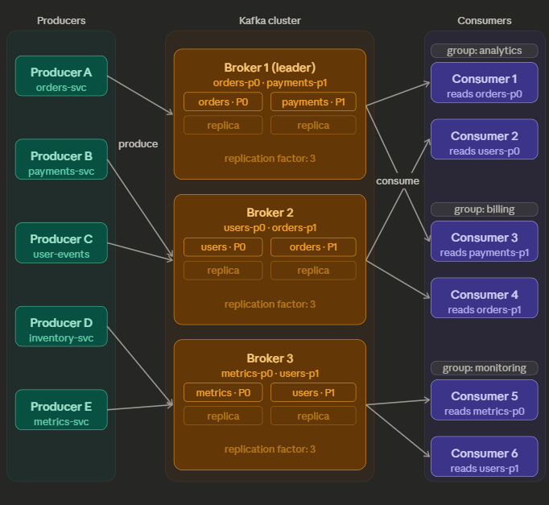

# Kafka

> [!NOTE]   
> **Status**: In Progress
---

## Architecture

## Architecture Breakdown
- 

Producers

- 

Kafka Cluster

  - 

Brokers

    - 

Topics

      - 

Partitions

      
- Consumer Groups
  - 

Consumers

## Notes
- **Topic**:
  - A topic in Kafka is split into partitions
- **Partitions**:
  - 1 partition → 1 consumer max
  - 10 partitions → 10 consumers max
- **Partition Key**: 
  - Kafka uses the key to decide which partition to send to
  - When a producer sends data, it may include a key
  - If producer does not sent a key, round robin
- **Offset**: 
  - Message position in a partition
  - Offsets are sequential numbers
  - Offsets are unique only within a partition
  - Kafka does not reuse offsets
- **Message Ordering**: 
  - Kafka guarantees ordering only within a partition.

- Exactly Once Processing
  - Apache Spark
  - Apacke Flink
- Zookeeper
- KRaft

## References
- [Youtube: Kafka Core Shorts](https://youtube.com/shorts/VGBqvMofNb4?si=rCRddQxEFAXaEw06)
- [Udemy - Apache Kafka Series - Learn Apache Kafka for Beginners v3](https://www.udemy.com/course/apache-kafka/?srsltid=AfmBOooHgJ2zPYPQgZN-J2sdG0vYirGkenl3hp73IewepV-UJsrg-J1f)
