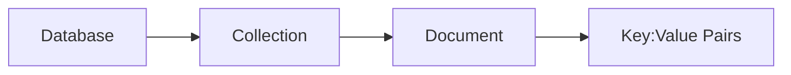
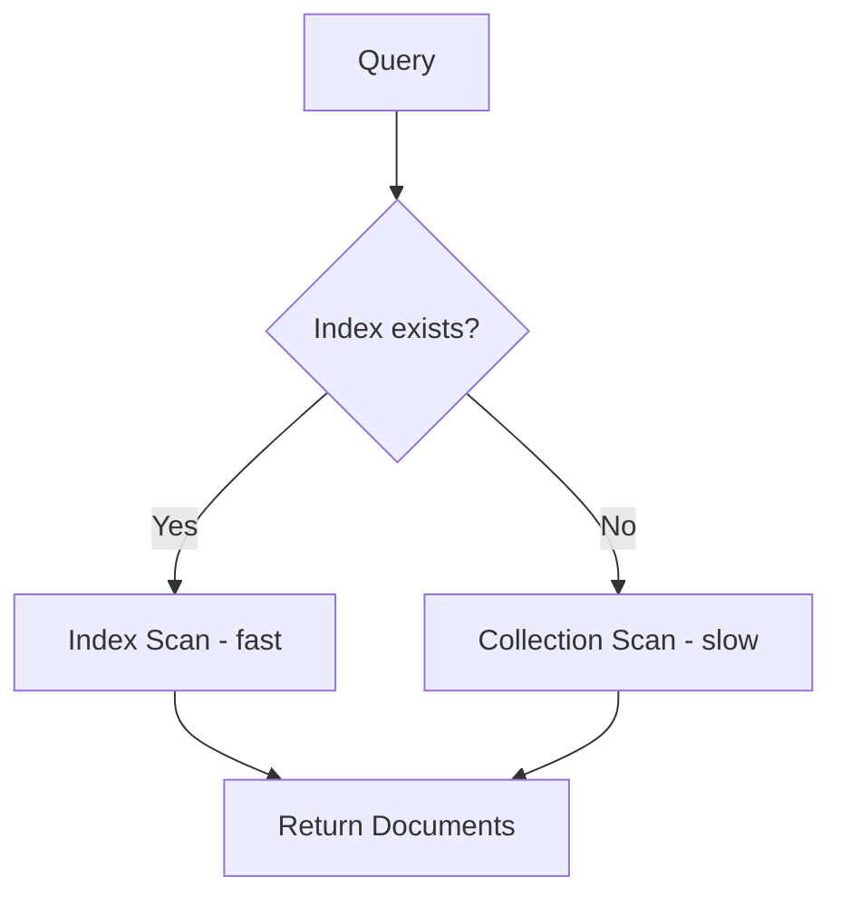
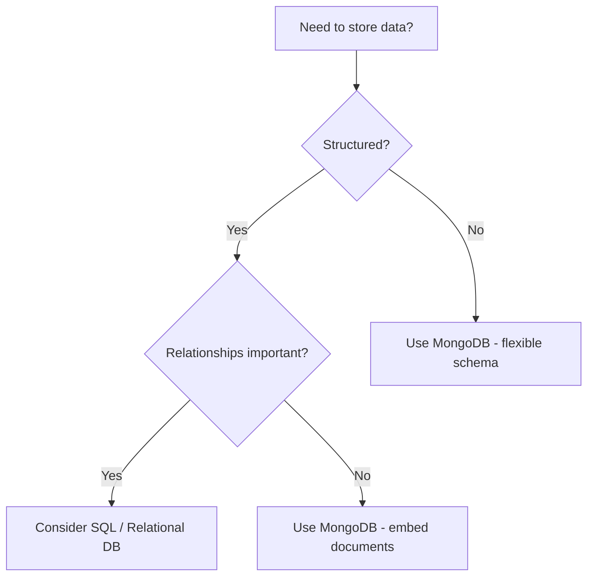

# MongoDB

> [!NOTE]
> **Status**: In Progress

---

## Architecture



<details>
<summary>Tools & Interfaces</summary>

- **MongoDB Compass** — GUI for browsing and managing data
- **Mongosh** — MongoDB Shell (interactive CLI)
- **MongoDB for VS Code** — Extension for querying from the editor

</details>

---

## Core Concepts

| Concept | Description |
|---|---|
| Collection | Group of documents (like a table) |
| Document | JSON-like record (BSON format) |
| Index | Improves query performance |

<details>
<summary>Commands</summary>

**Insert**
```js
db.collection.insertOne({ key: "value" })
db.collection.insertMany([{ key: "value" }, { key: "value2" }])
```

**Find**
```js
db.collection.find({ key: "value" })       // all matches
db.collection.findOne({ key: "value" })    // first match
```

**Update**
```js
db.collection.updateOne({ key: "value" }, { $set: { key: "new" } })
db.collection.updateMany({ key: "value" }, { $set: { key: "new" } })
```

**Delete**
```js
db.collection.deleteOne({ key: "value" })
db.collection.deleteMany({ key: "value" })
```

**Sort & Limit**
```js
db.collection.find().sort({ field: 1 })    // 1 = asc, -1 = desc
db.collection.find().limit(10)
db.collection.find().skip(5).limit(10)     // pagination
```

**Count & Distinct**
```js
db.collection.countDocuments({ key: "value" })
db.collection.distinct("field")
```

</details>

<details>
<summary>Query Operators</summary>

| Operator | Description |
|---|---|
| `$set` | Set a field value |
| `$unset` | Remove a field |
| `$exists` | Check field existence |
| `$ne` | Not equal |
| `$lt` / `$lte` | Less than / less than or equal |
| `$in` / `$nin` | Match / not match values in array |

</details>

<details>
<summary>Comparison Operators</summary>

| Operator | Description | Example |
|---|---|---|
| `$eq` | Equal to | `{ age: { $eq: 25 } }` |
| `$ne` | Not equal to | `{ age: { $ne: 25 } }` |
| `$gt` | Greater than | `{ age: { $gt: 18 } }` |
| `$gte` | Greater than or equal | `{ age: { $gte: 18 } }` |
| `$lt` | Less than | `{ age: { $lt: 65 } }` |
| `$lte` | Less than or equal | `{ age: { $lte: 65 } }` |
| `$in` | Matches any value in array | `{ status: { $in: ["A","B"] } }` |
| `$nin` | Matches none in array | `{ status: { $nin: ["A","B"] } }` |

</details>

---

## Indexes



<details>
<summary>Index Types & Commands</summary>

| Type | Description | Command |
|---|---|---|
| Single Field | Index on one field | `db.col.createIndex({ field: 1 })` |
| Compound | Index on multiple fields | `db.col.createIndex({ a: 1, b: -1 })` |
| Multikey | Index on array fields | Auto-created when field is array |
| Text | Full-text search | `db.col.createIndex({ field: "text" })` |
| TTL | Auto-delete docs after expiry | `db.col.createIndex({ date: 1 }, { expireAfterSeconds: 3600 })` |

**Tips:**
- `1` = ascending, `-1` = descending
- Use `db.col.getIndexes()` to list indexes
- Use `explain("executionStats")` to verify index usage

</details>

---

## Decision Tree



---

## Project

- MongoDB running in a Docker container

---

## References

- [Fireship - MongoDB in 100 Seconds](https://www.youtube.com/watch?v=-bt_y4Loofg)
- [MongoDB Explained in 10 Minutes](https://www.youtube.com/watch?v=GV9VBwH_h1U)
- [Bro Code - Learn MongoDB in 1 hour](https://www.youtube.com/watch?v=c2M-rlkkT5o)