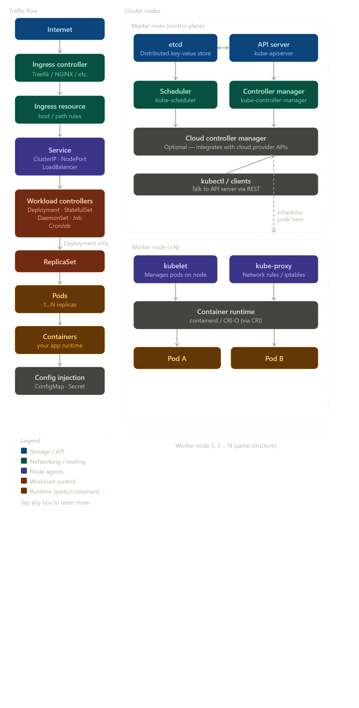

# Kubernetes

## Architecture Mental Model

<details>
<summary>Details: #1</summary>

```
🌍 Internet
(user / browser / API client)
        ↓
Ingress Controller (Traefik / NGINX / etc)
+ Ingress Resource (host/path rules)
        ↓
Service (stable networking abstraction)
- ClusterIP     (internal)
- NodePort      (node exposed)
- LoadBalancer  (external IP)
        ↓
Workload Controller (decides HOW pods run)
- Deployment   (stateless apps)
- StatefulSet  (stateful apps)
- DaemonSet    (1 per node)
- Job          (run once)
- CronJob      (scheduled)
        ↓
ReplicaSet (ONLY for Deployment)
        ↓
Pods (1..N replicas)
        ↓
Containers (your app runtime)
        ↓
Config Injection
- ConfigMap (non-sensitive config)
- Secret    (passwords, keys)
```
</details>

<details>
<summary>Details: #2</summary>


 
</details>

## Kubectl Commands

<details>
<summary>Details: #1</summary>

```bash
kubectl get           = list things
kubectl describe      = inspect details and events
kubectl logs          = view app logs
kubectl exec          = run command inside a container

kubectl create        = create a resource directly
kubectl run           = quickly create a Pod
kubectl expose        = create a Service for a Pod/Deployment
kubectl apply         = create/update from YAML
kubectl delete        = remove resources

kubectl edit          = edit live resource
kubectl scale         = change replica count
kubectl set           = update image/env/resources
kubectl patch         = update part of a resource
kubectl replace       = replace resource from YAML

kubectl rollout       = manage Deployment updates
kubectl port-forward  = access Pod/Service locally
kubectl cp            = copy files to/from a container

kubectl top           = view CPU/memory usage
kubectl config        = manage clusters, users, and contexts
kubectl auth          = check permissions
kubectl api-resources = list available resource types
kubectl explain       = explain YAML fields
```
</details>
