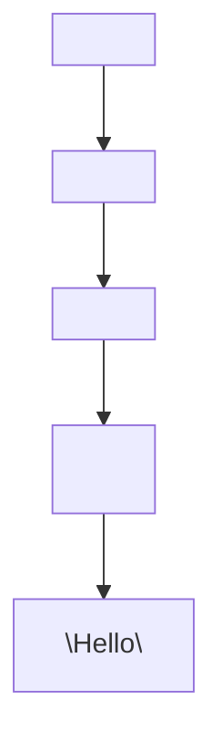
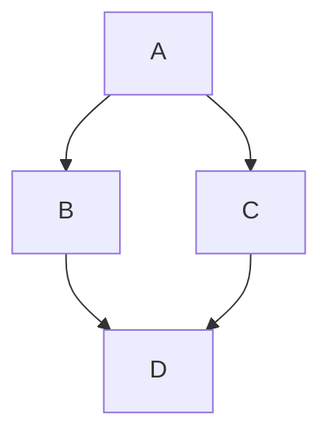

# React JS

## Notes

### Mental Model
    DOM 
        → The browser’s in-memory tree of UI elements.
    HTML 
        → The starting structure.
    JavaScript 
        → Directly manipulates the DOM (imperative).
    React 
        → Recalculates what the UI should look like based on state,
        → Then updates efficiently (declarative).

### Additional Info
    JSX - JavaScript + HTML
    Single Page Applications - One Template but updating components of the DOM
    In Javascript, functions do NOT need to be capitalized
    In React, Components MUST BE CAPITALIZED 

### DOM (Document Object Model)
    Browser's live in memory representation
    Mental Model: 
        The DOM is the browser’s tree of UI objects.
        React is a UI calculator that keeps that tree in sync with state.
```javascript
<html>
  <body>
    <div>
      <h1>Hello</h1>
    </div>
  </body>
</html>
```




### Virtual DOM (Document Object Model)
    A lightweight copy of the real DOM.
    React:
        Calculates changes in Virtual DOM.
        Compares old vs new (diffing).
        Updates only what changed (reconciliation).
    This makes React fast.

### Imports
    import React from "react";
        or
    import React, { useState } from "react"; 

### Componets
    Visual layer of the UI
    Header, Navigation Bar, Sidebar, Footer, .etc
    Components Function name must be capitalized with snakecase
    Components can only return one parent / root element 
        Fragment: <> ... </>

### Component Lifecycle
    Initialization → Mounting → Updating → Unmounting
    Component: Mounting → Updating → Unmounting
    Class Components:
        componentDidMount(){}
        componentDidUpdate(){}
        componentWillUnmount(){}

### URL Router
    Keep UI in sync with a router

### Props
    Pass components down from another
    Parent Child relationship
    Prop Drilling: Props can be passed down unlimited number of times

### State
    Javascript Object
    Represents information / "state" of a component
    Update State
    Declarative vs Imperative Programming 
    Hooks

### Hooks
    Add State to Functional Components
    Hooks are functions that allow us to hook into and manage state
    Common Hooks:
        useState()  // Set & Update State
        useEffect() // Perform side effects in lifecycle
    const [state, setStateFunction ] = useState(initialStateValue);

### State Management
    Tech: Context API, Redux
    So we dont have to manage prop drilling

### Key Prop
    List needs to have "key" prop

### Event Listeners
    Handling events
    <li onClick={openNote}>

### Handling Forms
    Examples: <input>, <textarea>, <select>
    <form onSubmit={handleSubmit}>
        <input type="text" onChange={updateNoteValue} value={note} />
        <input type="submit" />
    </form>

### Conditional Rendering
    Rendering an element if a condition is met
    Example: Display user's name if logged in, else display request to login
    Ternary Operator: 
        CONDITION ? TRUE : FALSE
        CONDITION ? TRUE : null
    (EXPRESSION && EXPRESSION)

### Common Commands
    npx create-react-app <appname> // Sets up your development environment
    npm start // Starts up development server
    npm run build // Creates an optimized build of your app

## Shorthand
    Map         → Create a new array by doing something with each item in an array
    Filter      → Create a new array by keeping the items that returns true
    Reduce      → Accumulate a value by doing something to each item in an array
    Find        → Find the first item that matches from an array
    FindIndex   → Find the index of the first item that matches
    
    Arrow Functions / Fat Arrow → const
    Anonymous Functions → () => {}
    
    Spread Operator → ...variable → Expand array
    Rest Parameters → ...variable → Bundle items into an array
    
    Descructure → 

#### Destructuring Objects & Arrays
    Array:
    Object:

    const { name, sound } = cat;                    //
    const { name: catName, sound: catSound } = cat  // Rename key  
    const { name = "fluffy", sound = "purr" } = cat // default value 

#### Spread Operator
    ...objectName
    Spread / Expand items of object 

## Questions
    What is the difference between hooks and event listeners
    Javascript statement vs expression
    Anonymous functions
    var vs let vs const
    single braces vs double curly braces
    Hooks vs Classes 
    React controlled vs uncontrolled name
    == vs ===
    Set object key by variable → [key]: value // Use square braces

## Review 
    312. Changing Complex State

## References
[Youtube: Fireship - React in 100 Seconds](https://www.youtube.com/watch?v=Tn6-PIqc4UM) 

[Youtube: Nova_Designs_ - Master React JS in easy way](https://youtu.be/E8lXC2mR6-k?si=cLj8dgs4d1-kgIVs) 

[Youtube: Dennis Ivy - React JS Explained in 10 Minutes](https://www.youtube.com/watch?v=s2skans2dP4)

[Youtube: Code Bootcamp - Every React Component Explained in 12 Minutes](https://www.youtube.com/watch?v=wIyHSOugGGw)

[Github: alan2207 / bulletprood-react / docs / project-structure.md](https://github.com/alan2207/bulletproof-react/blob/master/docs/project-structure.md)

[Github: Airbnb React/JSX Style Guide](https://github.com/airbnb/javascript/tree/master/react)
